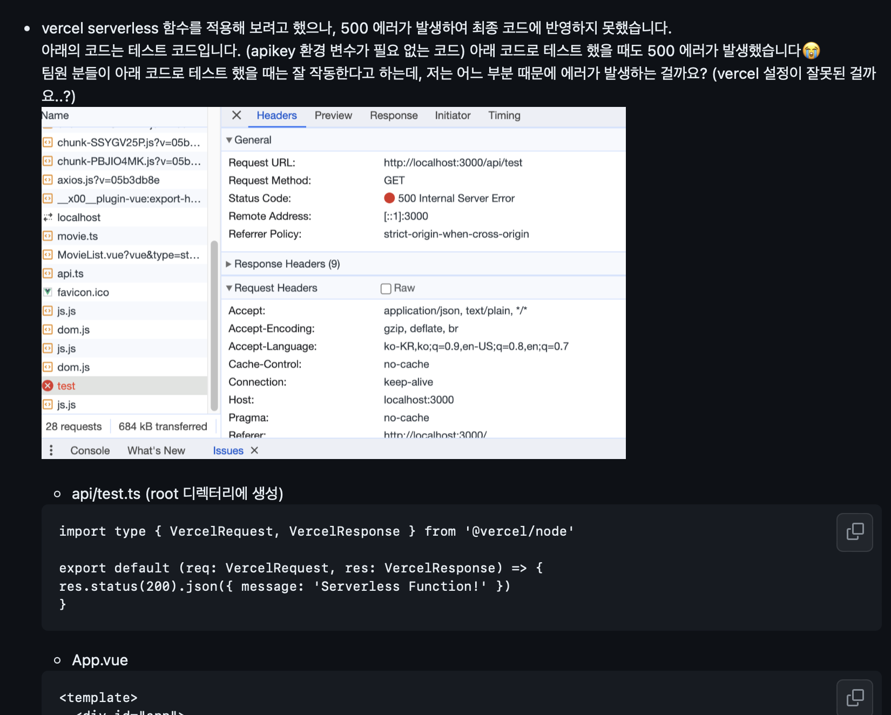
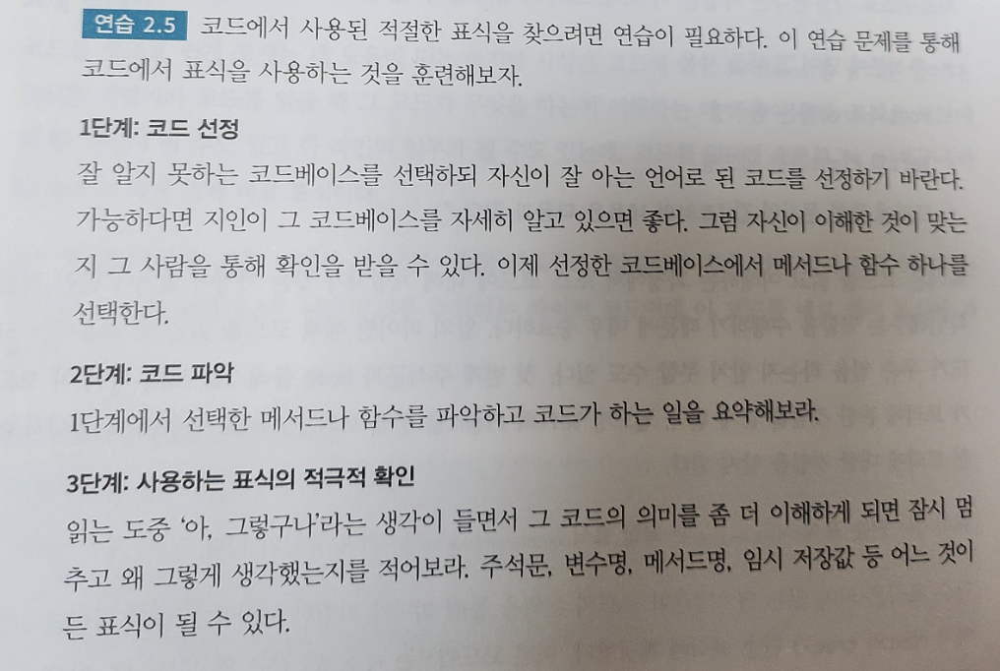
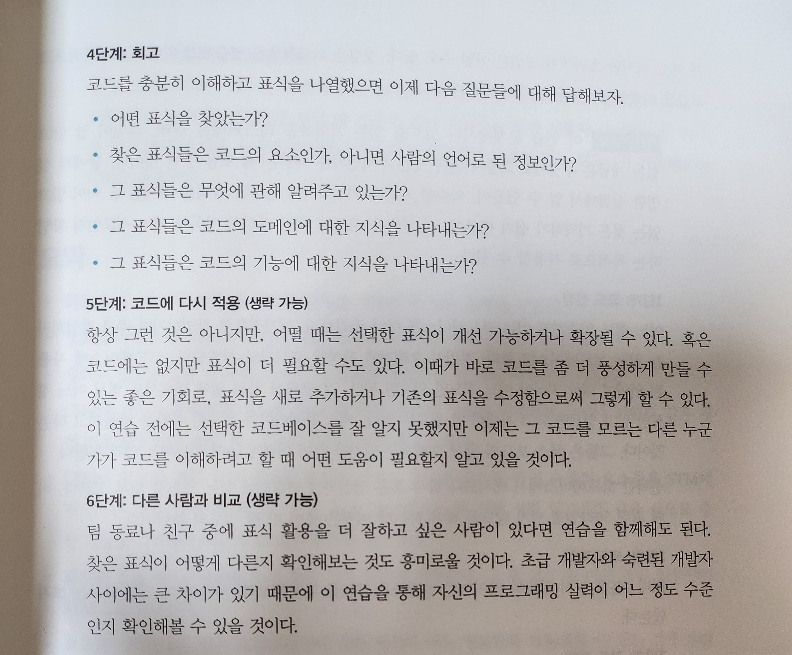

벌써 데브코스의 절반이 지나간다. 시간이 정말 빠르게 흘러가는 것 같다.

## Vue

Vue 과제 요구 사항 중 하나가 `클라이언트(브라우저)에서 API Key가 노출되지 않아야 합니다!` 였다. Vercel의 serverless 함수를 사용해서 API Key 노출을 막으려고 시도했으나, 테스트할 때 500 서버 에러가 발생하였다. API Key가 필요 없는 기본적인 테스트 코드를 구현하여 시도해 봤는데도 결과는 똑같았다. 오랜 시간 여러 방법을 동원하였지만 해결되지 않아 팀원분들과 멘토님께 여쭤봤지만 해결이 불가능했었다.



React 과제가 발표된 날에 다시 한번 시도했는데 성공해다…! 갑자기 왜 되는 거지…? 분명 저번이랑 같은 코드인데…. 얼떨결에 돼서 기분이 좋았지만, 아직 왜 되는지 명확한 이유를 찾지 못했다. 지난번에는 왜 안 되었던 건지 이유를 알고싶다ㅠㅠ

<br />

## React

React 강사님의 강의는 핵심적인 내용 위주이다. 그래서 강의 시간을 짧았으나, 스스로 공부해야 하는 내용이 많았다.

[React 공식 문서](https://react.dev/)나 다른 기술 블로그의 글을 읽으면서 추가로 궁금했던 부분을 보완해 나갔다. 공식 문서를 읽는 게 마치 도장 깨기 챌린지 같다.

처음 원문으로 공식 문서를 접했을 때는 뭔가 딱딱하고, 오랜만에 각 잡고 영어 문장들을 읽게 되어서 어려웠었다. 지금은 좀 더 공부해 보고 싶은 내용이 생기면 공식 문서를 가장 먼저 찾고 이해해 보는 습관을 들이게 된 것 같다.

<br />

## 팀 스터디

팀 스터디에서 테코톡을 제안하였다. 제안 배경은 다음과 같다.
데브코스의 주어진 환경을 최대한 활용하고, 팀원들과 함께하는 활동을 하나 해보고 싶었다. 또한, 앞으로 공부해야 할 지식의 범위와 내용이 방대한데, 이것을 서로가 채워주는 활동을 해보고 싶었다. 우아한테크코스 크루의 테코톡 영상을 보고 영감을 받아 우리 팀원분들에게도 제안을 하였다.

12월 28일에 첫 테코톡을 시작한다. 나는 HTTP를 주제로 발표할 예정이다. HTTP를 주제로 선정한 이유는 만약 누군가 나한테 HTTP와 메서드에 대해 질문을 한다면 어버버 대답할 것 같아서이다. 즉, 정확히 알지 못하기 때문에 테코톡을 준비하면서 HTTP에 대해 깊게 공부하고, 공부한 내용을 말로 풀어내고 싶어서 주제로 선정하였다. 아는 CS 지식의 양이 쑥쑥 늘면 좋겠다. 테코톡에 대한 자세한 이야기는 다음 MIL에 작성할 예정이다.

팀원 분들은 어떤 주제를 선정하였고, 어떻게 주제를 풀어나갈지 궁금하다. 기대된다😆 현재는 테코톡을 팀 단위로 진행하지만, 점점 규모를 넓혀나가도 좋을 것 같다.

<br />

## ⟪프로그래머의 뇌⟫ 책 읽기

지난 MIL 회고록에서 '⟪쏙쏙 들어오는 함수형 코딩⟫ 책 꾸준히 읽기'를 다짐했었지만, 기말고사와 반납 기간으로 인해 아쉽게도 꾸준히 읽지 못했다. 대신에 ⟪프로그래머의 뇌⟫ 책을 꾸준히 읽었다.

이 책은 뇌를 활용하여 더 나은 프로그래머가 되기 위한 방법을 다루며, 프로그래밍에 인지과학을 접목한 내용을 담고 있다. 1부에서는 코드를 읽을 때 우리의 뇌가 어떻게 동작하는지를 설명한다.

책을 읽다가 정말 인상 깊은 문구가 있어서 공유하고자 한다.

> 해럴드 아벨슨, 제럴드 제이 서스먼, 줄리 서스먼이 쓴 "컴퓨터 프로그램의 구조와 해석"에 다음과 같은 유명한 문장이 있다. "프로그램은 사람이 읽을 수 있도록 작성해야만 한다. 기계가 실행하는 것은 부차적인 일이다." 이 말이 사실임에도 현실적으로 프로그래머들은 코드를 읽는 법보다 작성하는 법을 훨씬 더 많이 연습한다.

지금까지 코드를 읽는 연습보다는 작성하는 연습을 더 많이 해온 것 같다. 그래서인지 아직까지도 다른 사람이 짠 코드를 읽는 게 쉽지 않고, 생각보다 오래 걸린다. 요즘 코드 리뷰를 하면서 코드 읽는 연습을 많이 해야 할 필요성을 느끼고 있다.





책에서는 위의 사진처럼 표시 찾기 연습을 권장하고 있다. 표시 찾기 연습을 통해 코드를 읽는 습관을 틈틈히 기르면 좋을 것 같다! 시도해 봐야지!

이처럼 책을 읽으면서 핵심을 찌르는 문장들도 많았고, 실제 실험 결과를 바탕으로 이야기를 풀어나가는 부분이 흥미롭다. 또한, 실제 코드를 예시로 들고 설명해 주는데, 그 덕분에 책을 몰입하면서 읽을 수 있었다.

남은 2~4장도 꾸준히 읽어볼 예정이다.
새해에는 올해보다 더 발전된 내가 되기 위해 노력해야겠다. 올해도 수고 많았당⭐️

```toc

```
