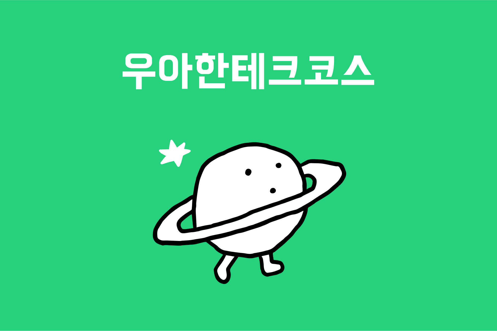
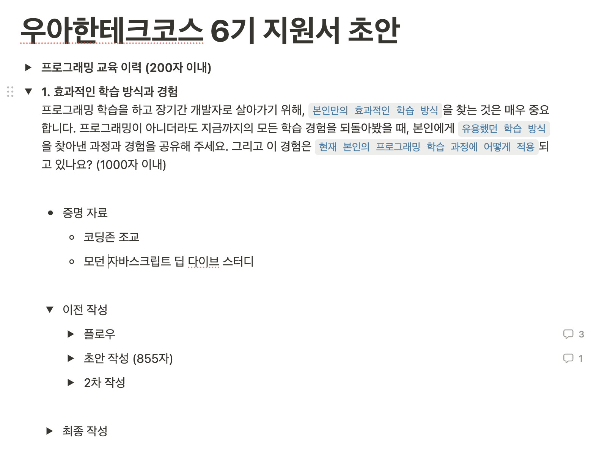
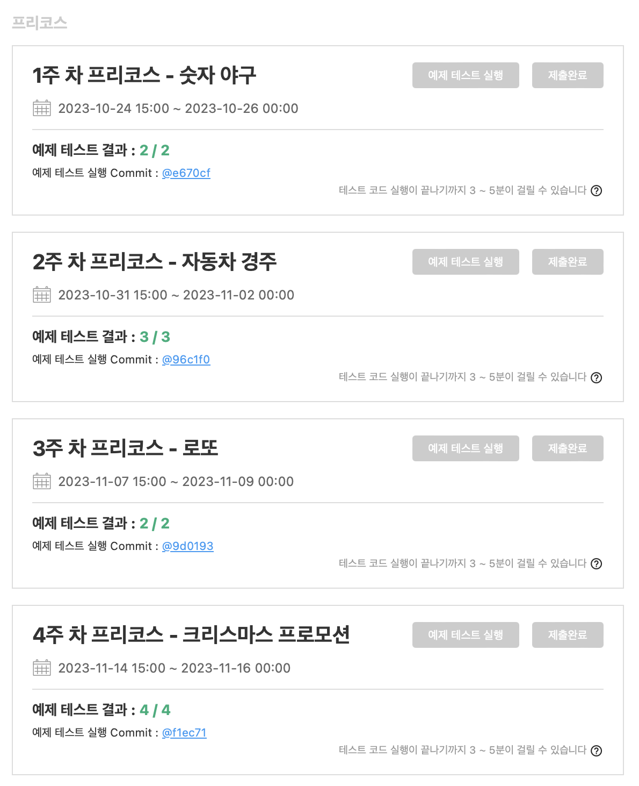
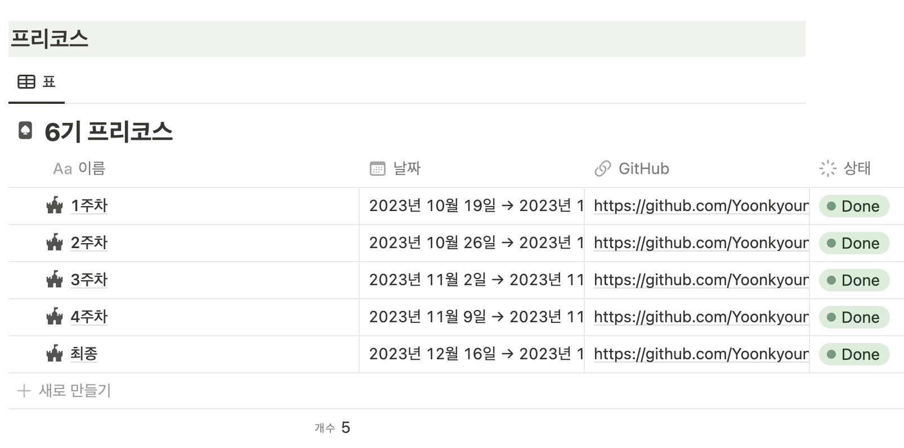
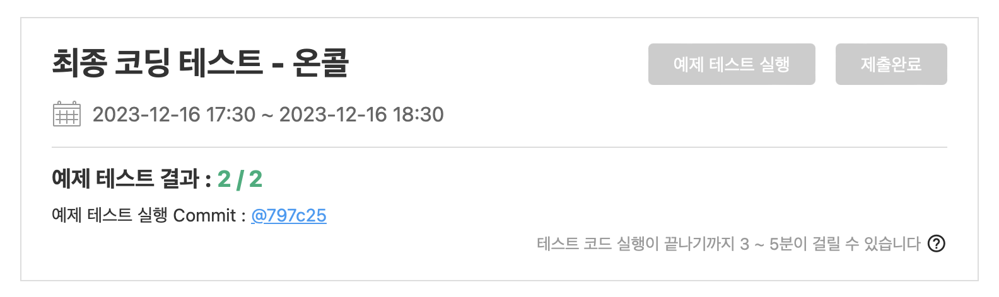
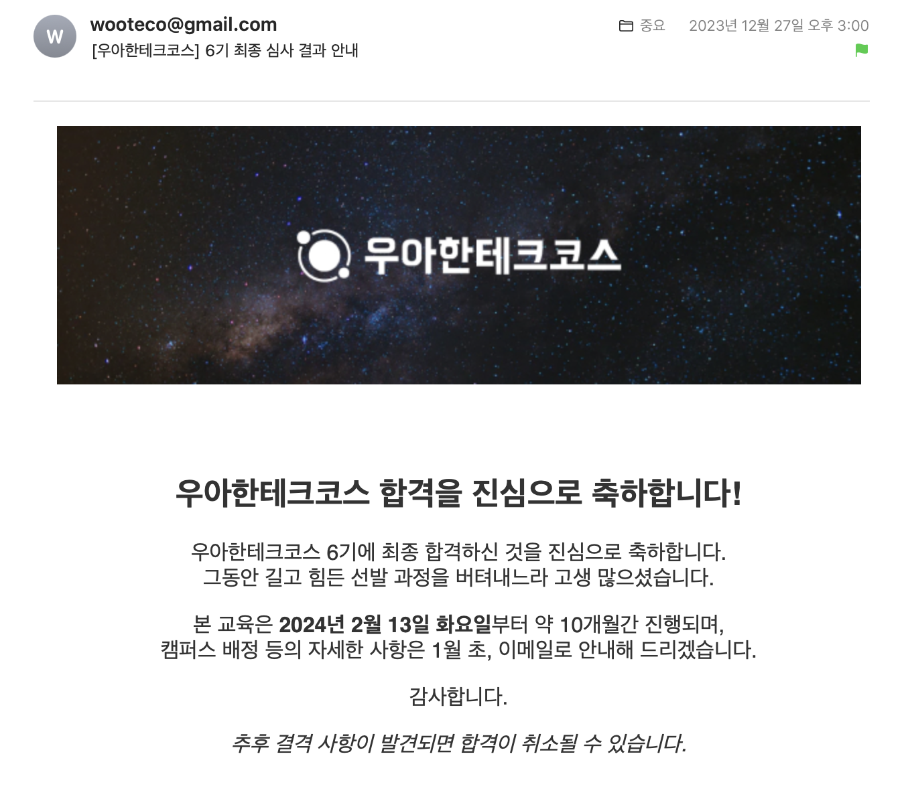

<br />

## 들어가며

---

작년에는 우아한테크코스 5기 최종 코딩 테스트에서 탈락했다.

프리코스를 진행하면서, 처음 지원했을 때보다 우아한테크코스에 참여하고 싶다는 마음이 더 커졌다.

매주 미션을 수행하며 배우고, 실패하고, 그 과정에서 성장하는 경험, 미션 후 받는 풍부한 피드백, 그리고 좋은 동료들과의 소통 등 프리코스 과정만으로도 얻어 가는 것이 많았다.

프리코스에서 얻었던 값진 경험들이 합격해서 본 코스를 해보고 싶은 마음으로 이끌었던 것 같다.

그래서 작년에 비해 더 간절한 마음으로 지원했고, 프리코스에 더욱 몰입하는 열정이 커졌다.

<br />

## 지원서

---

우아한테크코스에서는 지원서를 중요하게 여기는 것 같다.

나는 노션을 활용하여 지원서를 작성했고, 증빙 자료도 노션에 첨부하여 제출했다.



진심을 담은 나의 이야기가 잘 전달되길 바라며, 가능한 한 내가 작성한 글에 대한 근거가 될 수 있는 자료들을 찾아서 증빙 자료로 제출했다.

지원서는 각 문항에 대해 적을 수 있는 소재를 먼저 나열하고, 이를 키워드로 연결하여 전체적인 흐름을 만들었다. 이를 바탕으로 초안을 작성한 후, 여러 차례 수정하여 최종본을 완성했다.

우아한테크코스 백엔드에 지원한 지인과 서로 지원서를 첨삭해 주었다.

만약 기회가 있다면, 자소서 첨삭을 받아보는 것을 추천한다. 다른 사람의 시각을 통해 피드백 받은 글은 보다 매끄럽고 문맥에 맞는 글을 쓰는 데 도움이 된다.

<br />

## 프리코스 미션 진행

---

1주 차부터 3주 차까지는 미션 진행 방식이 5기 때와 같았다.

그러나 4주 차 미션과 최종 코딩 테스트는 새로운 방식으로 미션을 제출해야 했다. (비공개 저장소를 생성해 제출하는 방식이며, woowa-course 계정을 collaborator로 초대해야 했다.)



<br />

## 소감문

---



미션을 진행하는 동안, 중간중간에 특히 기억에 남는 순간들을 노션에 기록해 두었다.

주로 마주친 문제와 그 해결 방법, 그리고 새롭게 배운 내용들에 관한 것들이었다. 이런 기록들은 소감문 작성 시에 큰 도움이 되었다.

미션 공개 날에는 이전 주차 미션 공통 피드백과 이번 주차 미션에 대한 내용이 담긴 메일이 전송되었다. 이 메일에는 소감문 작성에 대한 안내도 포함되어 있었다.

> 과제를 제출할 때 이번 주 차 목표를 중심으로 학습하면서 느낀 점을 소감문으로 작성해 주세요. 이때 학습한 '과정'을 잘 드러내 주세요.

이런 가이드를 따라, 미션 시작 전에 목표를 세우고, 공통 피드백을 바탕으로 학습하며 느낀 점을 소감문에 담았다. 지금까지 소감문 쓴 것을 확인해 보니 글자 수는 900자에서 1300자 사이로 작성하였다.

글자 수보다 중요한 것은 우아한테크코스에서 요구하는 바에 따라, 목표를 중심으로 미션을 진행하면서 학습한 내용과 느낀 점을 위주로 잘 녹여서 작성하면 좋을 것 같다.

<br />

## 최종 코딩테스트 준비 과정

---

프리코스를 마친 후, 학업과 졸업 논문 준비로 인해 프리코스 과정을 복습하는 시간을 가지지 못했다.
1차 합격이 발표된 이후 최종 코딩 테스트 당일까지 약 5일의 시간이 있었다.

작년 최종 코딩 테스트 시작 전, 우아한테크코스 측에서는 다음과 같은 내용의 메일을 발송하였다.

> 시간 내에 모든 기능 요구 사항을 충족하기 위해 최선을 다하세요. **안 돌아가는 프로그램보다 돌아가는 쓰레기**를 만들어도 괜찮아요. 그런 다음 클린 코드, 리팩터링, 테스트 등을 챙기는 거예요.

그 당시에는 클린 코드, 예외 처리 등에 등에 집중했던 습관을 내려놓지 못하였고 결국 기능을 다 구현하지 못했었다. 60% 정도 구현했던 것 같다.

이번에는 5시간 동안 요구 기능을 구현하는 것을 우선으로 하고, 남는 시간에 리팩터링을 하는 것을 목표로 삼았다. 5시간을 온전히 사용할 수 있는 시간이 없어서, 하루에 2~3시간씩 타이머를 이용하여 이번 프리코스의 미션을 다시 수행해 보았다.

시간을 재면서 최종 코딩 테스트를 준비하는 것을 추천한다. 5시간 동안 내가 얼마큼 구현할 수 있는지 대략적인 파악이 가능하다. 또한, 자신에게 맞는 가이드라인을 미리 준비하여 시간을 절약할 수 있다.

나의 경우에는 최종 코딩테스트를 준비하면서 생각보다 변수, 상수, 함수명에 더 많은 시간을 쏟고 있는 것을 깨달았다. 그래서 작명은 gpt의 도움을 받아 빠르게 작성할 수 있도록 했다.

이처럼 자신에게 필요한 것을 알고, 미리 준비해 가는 것을 추천한다.

<br />

## 최종 코딩 테스트 당일

---

최종 코딩 테스트 시작 전, 와이파이 이슈가 발생했다. 운이 좋게도 가장 먼저 연결에 성공하여 포비님이 확인차 내 이름을 호명해 주셨다. 영광이었고, 뭔가 시작부터 긍정적인 기운이 느껴졌다.

기본 기능 구현은 1시간을 남기고 완료하였고, 지원 플랫폼에 제출하여 '2/2'가 뜨는 것을 확인했다. 일단 돌아가는 코드를 만드는 데 성공하였다.



남은 시간 동안에는 문제 해결 전략을 작성하고, 코드를 리팩터링 하며, 소감문을 썼다. 문제 해결 전략 작성은 이번에 처음 도입된 것 같았다. 필수적으로 작성해야 하는 부분이었지만, 놓친 분들도 있었을 것 같다.

최종 코딩 테스트는 나 자신과의 대결이라고 생각하고 전념하였다.

작년에는 부족한 점이 많았지만, 올해는 그런 부분들을 많이 보완한 것 같다. 그래서인지, 소감문을 쓰면서 뿌듯함과 감동을 느꼈다. 작년보다 성장했다는 것을 느낄 수 있었다.

시험을 마친 후, 집에서 다시 생각해 보니 테스트 코드는 통과했지만, 놓친 부분이 있었다.

`평일이면서 법정공휴일의 경우에만 요일 뒤에 (휴일) 표기를 해야 한다.`이라는 요구 사항을 제대로 확인하지 못하고, 모든 법정공휴일에 (휴일)을 표기하도록 코드를 작성했다.

아쉬운 점도 많았지만, 그날 나는 주어진 5시간 동안 최선을 다했다고 생각한다.

<br />

## 최종 결과

---

우아한테크코스 6기에 최종 합격하였다.



긴 여정이었던 우아한테크코스 프리코스가 마무리되었다. 돌이켜 보면, 두 번의 우아한테크코스를 통해 크게 성장한 것 같다. 합격이 정말 간절했던 만큼 프리코스 과정에 몰입하여, 후회 없는 결과를 얻기 위해 최선의 노력을 다하였다. 이런 좋은 경험을 제공해 주신 우아한테크코스에게 감사의 마음을 전한다🙏

```toc

```
