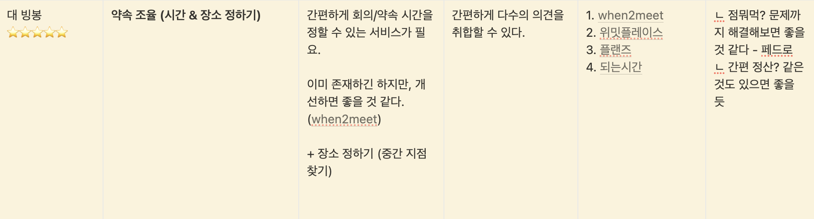
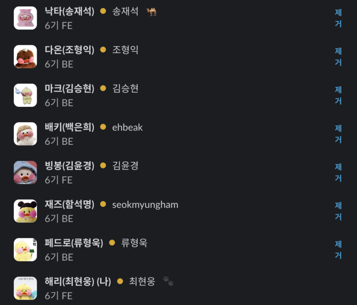
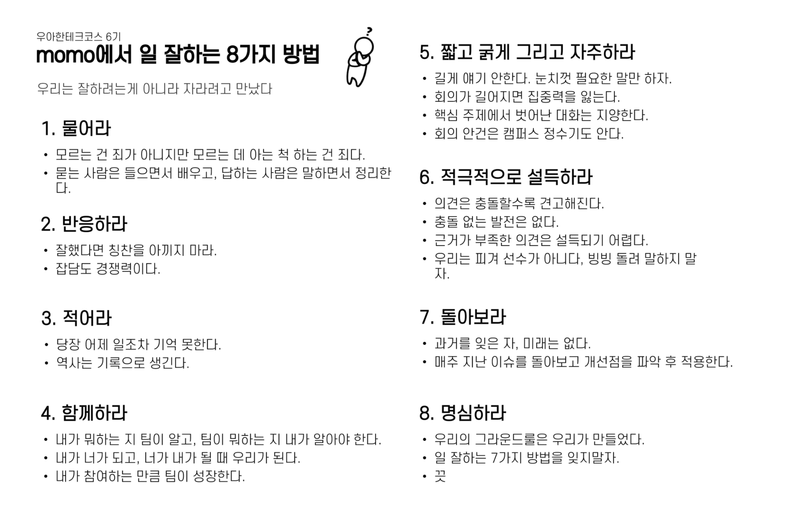
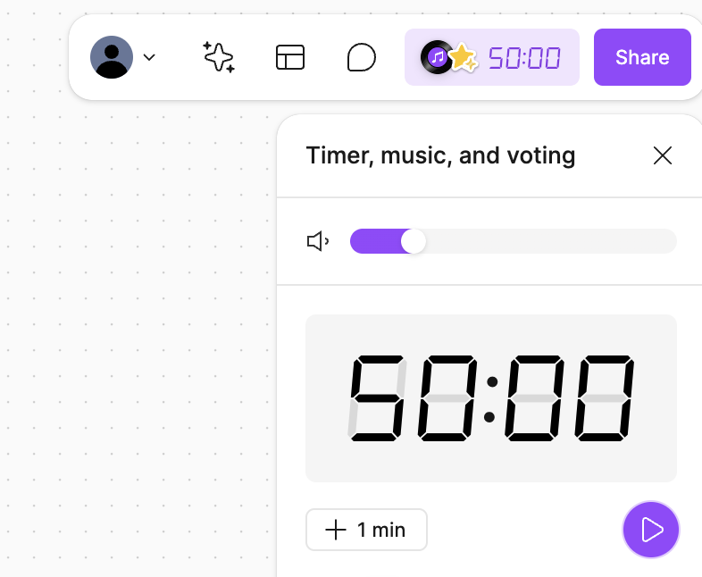

## 레벨3 팀 프로젝트 시작

우아한테크코스 레벨 3가 시작되었다.

약 5개월간 진행된 우아한테크코스 레벨 1, 2 과정은 페어 프로그래밍과 개인 미션으로 구성되었다.
레벨 3는 팀 프로젝트로 진행되며, 팀 멤버는 랜덤으로 결정된다.

 

## 우리의 서비스

팀원 모두의 아이디어를 노션에 적으면서 브레인스토밍을 했다.

내가 제안한 서비스 주제는 `약속을 편하게 조율할 수 있는 서비스`다.

그동안 친구들과 만날 시간이나 동아리 회의 시간을 정할 때, 모두의 일정을 취합하고 다수가 가능한 요일과 시간대를 파악하는 것이 쉽지 않았었다. 특히 모임 참여자가 많을수록 더 어려웠다.

이런 문제를 해결하기 위해 when2meet이라는 서비스를 사용해봤지만, 누가 언제 가능한지 한눈에 확인하기 어려웠다.

편함을 느끼고 대안을 찾았으나, 그 대안도 충분하지 않다는 점에서 개선된 서비스를 만들고 싶다는 생각이 들었다.

또한, 대면 만남을 계획할 때, 가장 먼저 만날 날짜와 시간을 정하고 그 다음으로 장소를 결정하게 된다. 이때 많은 사람들이 '어디서 만나지?' 혹은 '공평하게 중간지점이면 좋겠는데?'라는 고민을 하게 된다. 이런 고민을 해결하기 위해, 중간 지점을 찾아주는 기능을 추가하면 유용할 것이라고 생각했다. 이처럼 약속과 관련된 시간과 장소를 한 곳에서 간편하게 조율할 수 있게 하는 서비스를 만들고 싶었다.

다양한 주제에 대한 흥미로운 아이디어가 많이 나왔는데, 영광스럽게도 내 아이디어가 우리 팀의 주제로 선정되었다. 그때 당시 표현을 많이 못 했지만, 너무 기뻤다.

 

## 팀 momo

우리 팀은 프론트엔드 3명(빙봉, 해리, 낙타), 백엔드 5명(다온, 마크, 배키, 재즈, 페드로)으로 구성되어 있다.

팀원 모두가 귀여운 빵빵덕 사진으로 슬랙 프로필 사진을 맞췄다. 귀엽다😻

그동안 주로 프론트엔드 프로젝트만 했었는데, 이번에는 백엔드와 함께 협업하는 프로젝트를 해볼 수 있어서 설레기도 하고, 동시에 긴장도 된다☺️

 

### 그라운드 룰

팀원들이 서로를 존중하고 원활한 소통을 도와주는 규칙이 필요하다. 중요한 점은 이 규칙을 누군가가 일방적으로 정하는 것이 아니라, 팀 구성원들이 스스로 만들어 가야 한다는 것이다.

팀원들의 ‘[나 사용서](https://github.com/woowacourse/retrospective/discussions/48#discussioncomment-9955499)’ 내용을 공유를 바탕으로 우리 팀의 그라운드 룰을 만들었다.

모든 규칙이 정해진 계기를 나열하기에는 너무 많으니 몇 가지 규칙에 대해서만 이야기해 보겠다.

하나의 주제에서도 다양한 케이스를 고려하다 보니 원래의 회의 목적과는 다르게 논의가 너무 깊어지거나 주제 전환이 자주 일어났다. 길어지는 회의 시간을 줄이고, 회의 주제에서 벗어나는 것을 방지하기 위해 `짧고 굵게 그리고 자주 하라`는 그라운드 룰을 만들었다.

이를 위해 피그잼의 타이머 기능을 이용해 회의를 진행하였다.

50분으로 타이머를 설정하고, 처음 10분은 회의에서 다룰 안건을 정리한 후, 40분 동안 본격적인 회의를 진행하였다. 이후 10~15분 정도의 쉬는 시간을 가졌다. 이렇게 회의를 진행하면 회의가 루즈해지지 않고, 집중력이 떨어질 때쯤 쉬는 시간을 가져 머리를 환기하고 의견을 정리하는 데 도움이 되었다.

우리 팀 문화가 잘 지켜지고 있는지 돌아보면, 전반적으로 잘 유지되고 있는 것 같다.

특히, 프론트엔드 환경 설정을 할 때 낙타, 해리와 함께 3인 페어프로그래밍을 했는데, 우리 모두가 '왜?'라는 질문을 많이 하고, 그에 대한 답변이 근거 있고 충분히 이해되어야 다음 단계로 넘어갔다. 나 혼자 했을 때보다 시간이 오래 걸렸지만, 덕분에 이해를 하면서 환경 설정을 할 수 있었다. 낙타, 해리와 함께하는 페어프로그래밍이 시간이 재미있고, 유익하다. (나만 이렇게 생각하는 거 아니지?)
